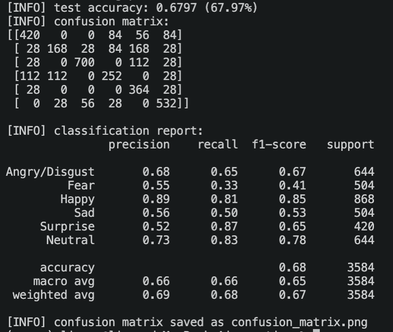
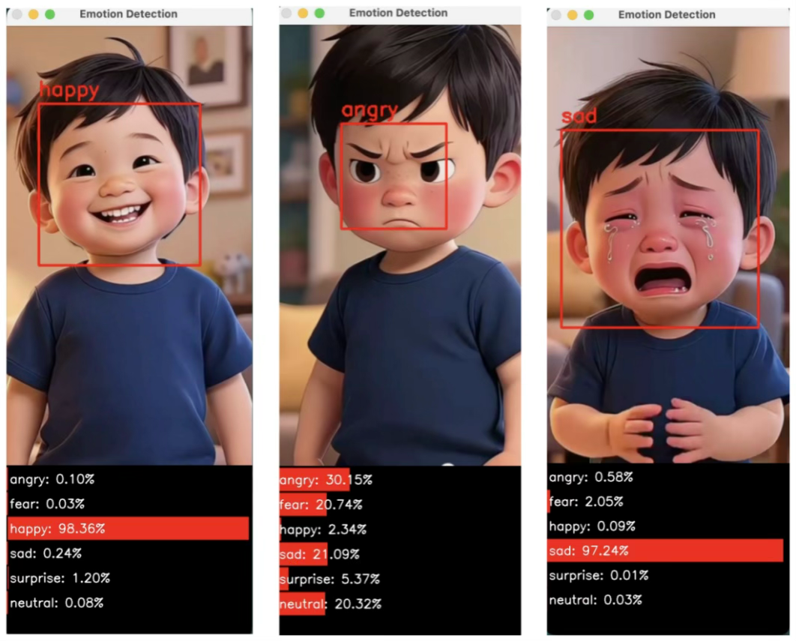

# Facial Emotion Recognition System

This facial expression recognition system, based on the FER2013 dataset, supports various deep learning models (SimpleCNN, EmotionVGGNet, Mini-Xception, MobileNetV2, etc.) and provides a complete workflow tool from data preprocessing, model training, evaluation to real-time video detection.
## Project Structure

```text
.
├── build_dataset.py                      # Convert fer2013.csv to HDF5 format
├── train_recognizer.py                   # Train models
├── test_recognizer.py                    # Evaluate model, output confusion matrix and classification report
├── emotion_detector.py                   # Real-time facial emotion detection on video
├── haarcascade_frontalface_default.xml   # OpenCV face detector cascade
├── config
    ├──emotion_config.py                  # Configuration file (paths, batch size, etc.)
├── datasets/
│   ├── fer2013/                          # FER2013 dataset directory
│   │   ├── fer2013.csv                   # Raw dataset
│   │   ├── checkpoints/                  # Model checkpoint directory
│   │   ├── hdf5/                         # Generated HDF5 files
│   │   └── outputPath/                   # Training curves and history JSON
│   └── video/
│       └── test.mp4                      # Sample test video file
├── pyimage/                              
│   ├── callback/                         # Training callbacks (checkpoint, monitor, early stop)
│   ├── io/                               # HDF5 reader/writer and data generator
│   ├── model/                            # Model definitions
│   └── preprocessing/                    # Image preprocessing (to array, etc.)
└── requirements.txt                      # Dependency list
```
## Environment configuration
1. Create a virtual environment (recommended)

   ```bash
   python -m venv venv
   source venv/bin/activate   # Linux/macOS
   # .\venv\Scripts\activate   # Windows

2. Install dependencies
    ```bash
    pip install -r requirements.txt
    #Note: If using an Apple Silicon Mac, please install tensorflow-macos and tensorflow-metal manually.

## Data preparation
1. Download the FER2013 dataset or obtain it from the official source. [fer2013.csv](https://www.kaggle.com/datasets/deadskull7/fer2013)
2. Place fer2013.csv in the datasets/fer2013/ directory.
3. Run the data preprocessing script：
    ```bash
    python build_dataset.py
    This script will generate three files: train.hdf5, val.hdf5, and test.hdf5, and save them in datasets/fer2013/hdf5/.
## Model training
| Model type | Explanation                |
|----------|----------------------------|
| `simple_cnn` | Lightweight CNN, baseline model              |
| `emotion_vggnet` | VGG style network, activated using ELU.         |
| `mini_xception` | Basic version Mini-Xception          |
| `mini_xception_final` | Final optimized version: MixUp + Cosine Annealing + AdamW |
1. **Example command：**

    ```bash
    # Training the final optimized version of Mini-Xception
    python train_recognizer.py --checkpoints ./datasets/fer2013/checkpoints --model_type mini_xception_final
    
    # Training Emotion_VggNet
    python train_recognizer.py --checkpoints ./datasets/fer2013/checkpoints --model_type emotion_vggnet
    
    # Resume training from existing checkpoints (baseline model only)
    python train_recognizer.py --checkpoints ./datasets/fer2013/checkpoints --model ./checkpoints/emotion_vggnet_epoch_20.hdf5 --model_type emotion_vggnet --start-epoch 20
## Model Evaluation  
1. **Use test_recognizer.py to evaluate the trained model: **

    ```bash
    python test_recognizer.py --model ./datasets/fer2013/checkpoints/mini_xception_final_best_epoch_106.hdf5

2. **The output includes:**
* Test set accuracy
* Confusion matrix (print + save as confusion_matrix.png)
* Precision, recall, and F1 score for each class
* Example image:


## Video Facial Expression Detection
1. **Real-time facial expression recognition of video files using a trained model:**
    
    ```bash
    python emotion_detector.py --cascade haarcascade_frontalface_default.xml --model ./datasets/fer2013/checkpoints/mini_xception_final_best_epoch_106.hdf5 --video ./datasets/video/test.mp4


## Screenshot



## Frequently Asked Questions

### Insufficient Memory During Training
Reduce the BATCH_SIZE in emotion_config.py (default 128), for example, to 64 or 32.


## References

This project is based on the following works:

* FER2013 dataset

* OpenCV face detection

* Keras/TensorFlow deep learning framework